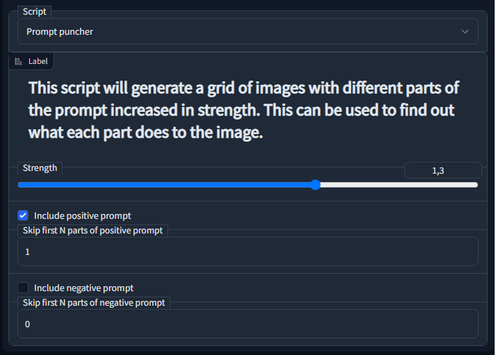
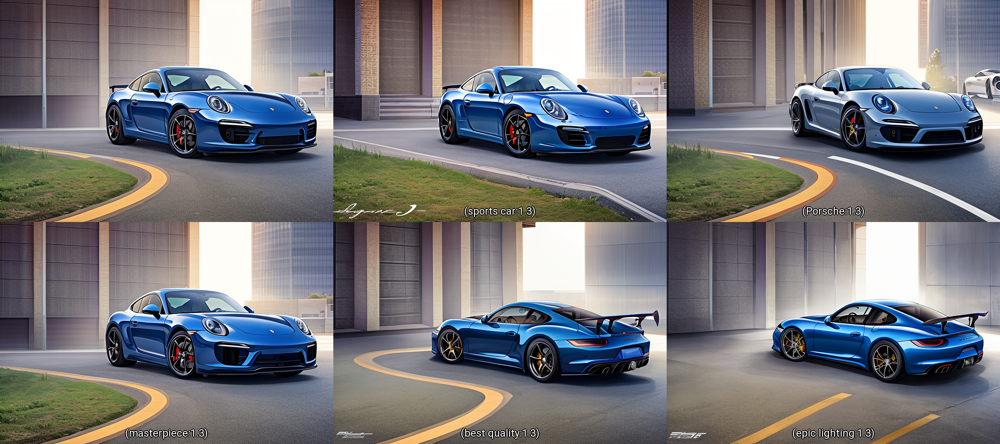
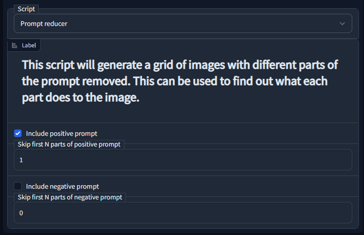

# stable-diffusion-webui-prompt-utilities
This an extension for [stable-diffusion-webui](https://github.com/AUTOMATIC1111/stable-diffusion-webui)

This is a set of utilities for the stable-diffusion-webui.

## Installation

go to the directory \<stable-diffusion-webui project path\>/extensions and run command  to install: `git clone https://github.com/hallatore/stable-diffusion-webui-prompt-utilities` and restart your stable-diffusion-webui.

 [See here for more install details]( https://github.com/AUTOMATIC1111/stable-diffusion-webui/wiki/Extensions)

## Prompt reducer

This script will generate a grid of images with different parts of the prompt removed. This can be used to find out what each part does to the image.

### Example prompt
    sports car, Porsche, masterpiece, best quality, epic lighting
    Negative prompt: text, b&w, weird colors, (cartoon, 3d, bad art, poorly drawn, close up, blurry, disfigured, deformed, extra limbs:1.5)
    Steps: 30, Sampler: DPM++ 2M Karras, CFG scale: 5, Seed: 1960802277, Size: 768x512

## Prompt puncher

This script will generate a grid of images with different parts of the prompt increased in strength. This can be used to find out what each part does to the image.

### Example prompt
    sports car, Porsche, masterpiece, best quality, epic lighting
    Negative prompt: text, b&w, weird colors, (cartoon, 3d, bad art, poorly drawn, close up, blurry, disfigured, deformed, extra limbs:1.5)
    Steps: 30, Sampler: DPM++ 2M Karras, CFG scale: 5, Seed: 1960802277, Size: 768x512

